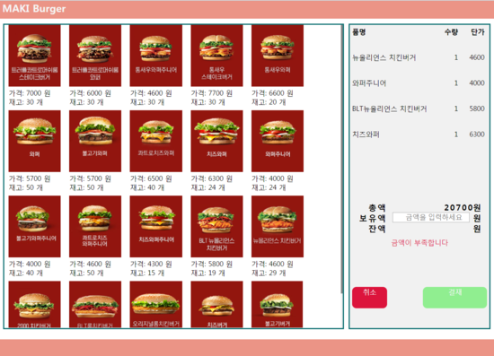

# Pos
Jquery를 이용해 구현한 햄버거가게 Pos시스템

## 프로젝트 소개
JavaScript대신 Jquery를 사용하여 햄버거가게 Pos시스템을 구현해 보았습니다.
메뉴의 사진과 가격, 재고를 한눈에 보기쉽도록 나열하였고, 클릭을 하여 주문을 하면
주문한 갯수 만큼 재고가 감소합니다. 주문한 상품명과 갯수를 볼 수있도록 하였으며,
각각의 가격과 총 합을 나타낼 수 있도록 하였습니다.
기존의 길고 어려운 JavaScript대신 Jquery를 사용하는 방법을 익히기 위해 진행해 보았습니다.

## 작업 환경
- 언어 : HTML, Jquery, CSS
- 개발도구 : 이클립스
- 운영체제 : Windows
- 형상관리 : git, github

## 구현 화면

